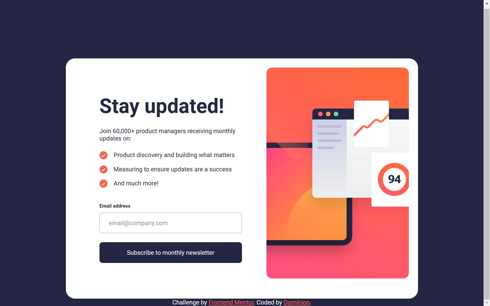
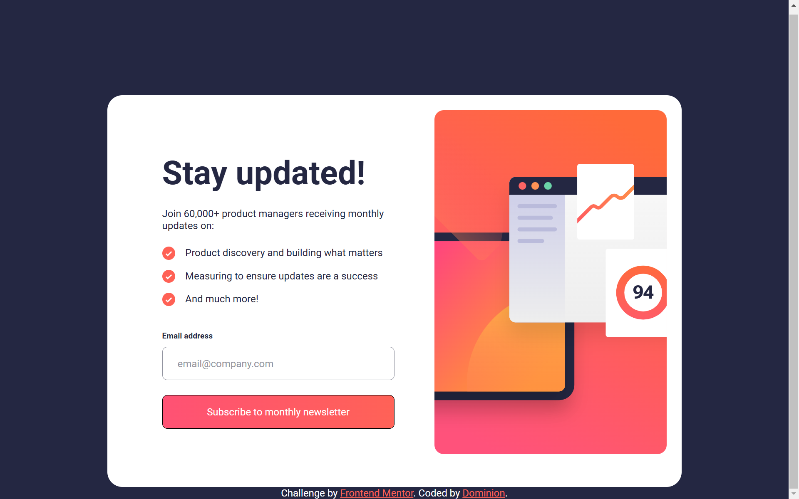
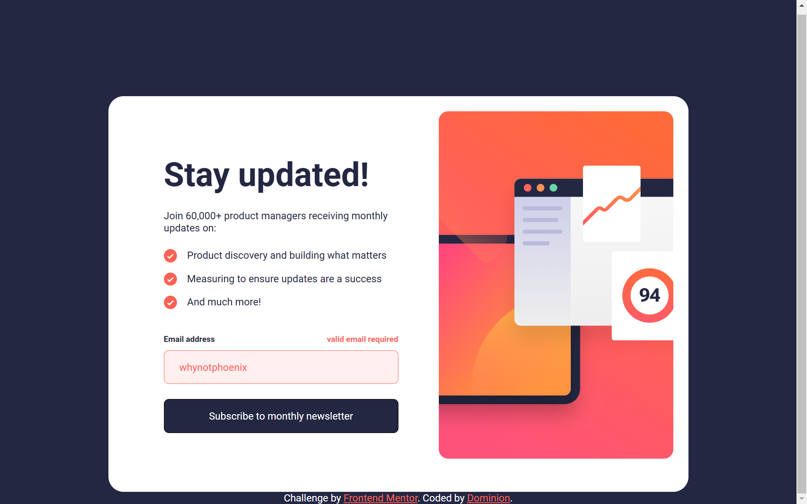
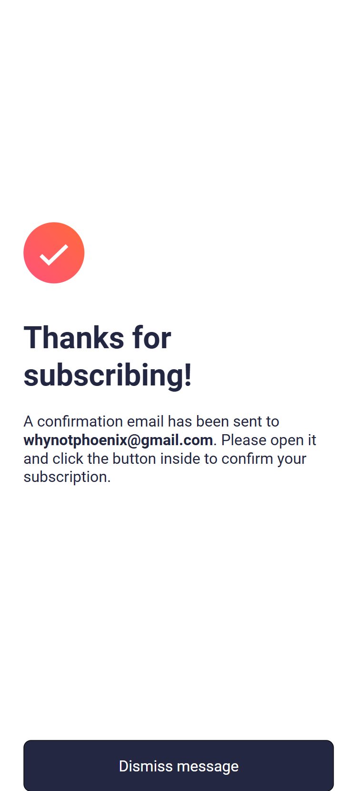
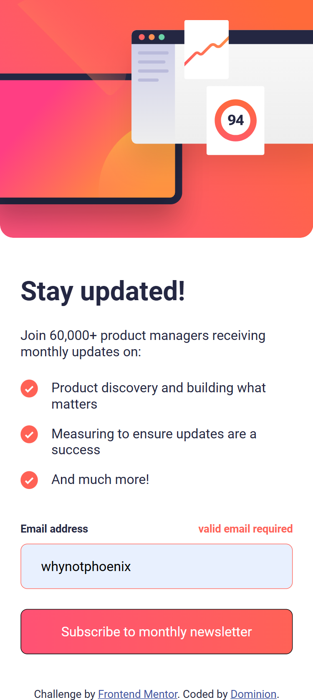

# Frontend Mentor - Newsletter sign-up form with success message solution

This is a solution to the [Newsletter sign-up form with success message challenge on Frontend Mentor](https://www.frontendmentor.io/challenges/newsletter-signup-form-with-success-message-3FC1AZbNrv). Frontend Mentor challenges help you improve your coding skills by building realistic projects. 

## Table of contents

- [Overview](#overview)
  - [The challenge](#the-challenge)
  - [Screenshot](#screenshot)
  - [Links](#links)
- [My process](#my-process)
  - [Built with](#built-with)
  - [What I learned](#what-i-learned)
  - [Continued development](#continued-development)
  - [Useful resources](#useful-resources)
- [Author](#author)

## Overview

### The challenge

Users should be able to:

- Add their email and submit the form
- See a success message with their email after successfully submitting the form
- See form validation messages if:
  - The field is left empty
  - The email address is not formatted correctly
- View the optimal layout for the interface depending on their device's screen size
- See hover and focus states for all interactive elements on the page

### Screenshot

### Links

- Solution URL: [Add solution URL here](https://your-solution-url.com)
- Live Site URL: [Add live site URL here](https://your-live-site-url.com)

## My process

### Built with

- Semantic HTML5 markup
- CSS custom properties
- Flexbox
- JavaScript
- Mobile-first workflow

### What I learned

This was a very interesting challenge. Despite the fact that I didn't know a lot of how to deal with forms before hand, I was able to research on it and I am happy with the results.

### Continued development

More JavaScript and Advanced CSS

### Useful resources

- [Resource 1](https://developer.mozilla.org/en-US/docs/Web/API/FormData/FormData) - formData
- [Resource 2](https://stackoverflow.com/questions/2276463/how-can-i-get-form-data-with-javascript-jquery) - more formData
- [Resource 3](https://imagecolorpicker.com/#google_vignette) - for my .btn gradient

## Author

- Frontend Mentor - [@why-not-phoenix](https://www.frontendmentor.io/profile/why-not-phoenix)
- Twitter - [@dominion_onoja](https://x.com/dominion_onoja?t=RAWgmHy3YlUySDiPDnZS2g&s=09)
